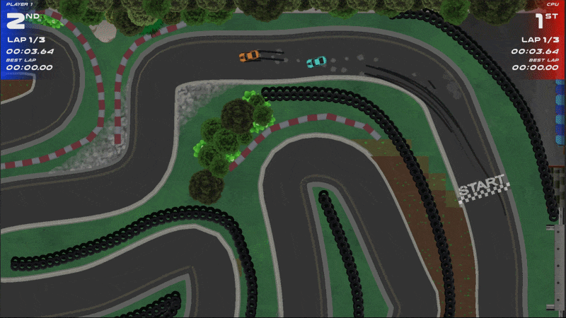
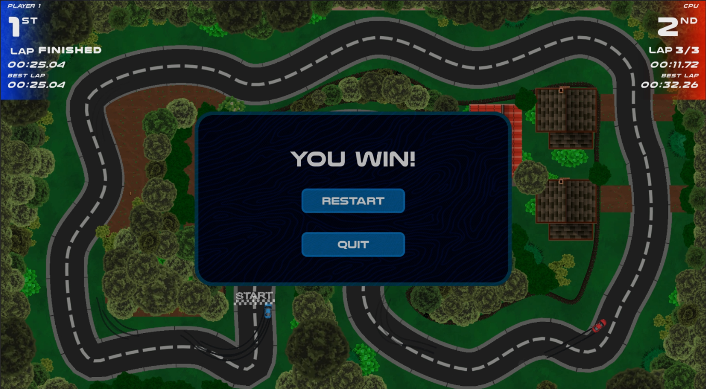

# Race Rivals

A 2D top-down racing game inspired by classic arcade racers like Indy 500 (1977 video game), evolved into a competitive 1v1 experience focused on player control, AI behaviour, and robust game systems. This project is the fourth mini game I developed, building on previous projects with a more complete “game-like” structure. The core features include:

- Further enhancements of Visual And Audio Effects handling.
- UI Systems with Unity UI Toolkit: Main menu, Mode Selection, and Pause, Settings, and Loading Screen.
- Settings Menu with adjustable difficulty, camera, audio, rebindable controls.
- Support for local multiplayer (1v1)
- AI Behaviour: Follow track path, drift around corners, reverse and recover when stuck.
- Spline-Based Track Design, used for Road texture and AI pathfollowing.
- Scene Management & Loading: Core scene system with additive level loading
- Functional loading screen between scenes

## Gameplay
Race against AI or another player, using WASD/Arrow Keys, and handbrake input to drift around corners. Choose from 4 distinct vehicles with varying stats and race on 3 unique tracks. 

In Race Mode, compete to finish first in a circuit race, or in Time trial mode, race against the clock and earn a Gold, Silver or Bronze medal, or if playing 2-Player, win by getting the best lap time within the race. 

Clone and build this project in Unity to Play:
### 🔗 https://github.com/SaedulH/Mini-Game-4---Race-Rivals.git

 

## Key Systems
- Scene Management: Bootstrapper scene to connect CoreScene with Main Menu on Startup, this follows the 'Single Entry Point' architectire architecture with additive scene loading, Dedicated loading screen, Smooth transitions between menus and gameplay. The Core scene houses all the singletons for initialising UI, Audio, levels and setting up players and AI.

- AI System: Path-following using spline data, Cornering and drifting, collision recovery, reversing when stuck, and realignment to track direction, coupled with difficulty scaling based on settings (Easy or Hard).

- UI Management: Built using Unity UI Toolkit: Main Menu, Mode selection, Track and vehicle selection, Pause Menu, Resume / Restart / Quit logic, and Settings Menu.
  
- Game Settings: Difficulty selection (Easy/Hard), Camera modes (Static/Dynamic), Screen shake toggle (Off/Low/High), Audio controls (4 audio groups), Fully rebindable controls for both players.

## Challenges
- Designing AI that uses the same control input as the player, and feels responsive and believable.
- Handling two-player input systems with rebinding cleanly.
- Structuring UI Toolkit layouts for scalability.
- Ensuring smooth scene transitions with additive loading.
- Balancing arcade-style handling with readable track design.

## If I Revisited This Project
- Add online multiplayer support via peer-to-peer sessions.
- Expand AI with personality/behaviour variations, allowing overtaking and blocking.
- Improve vehicle handling differences further.
- Add controller support alongside keyboard rebinding
